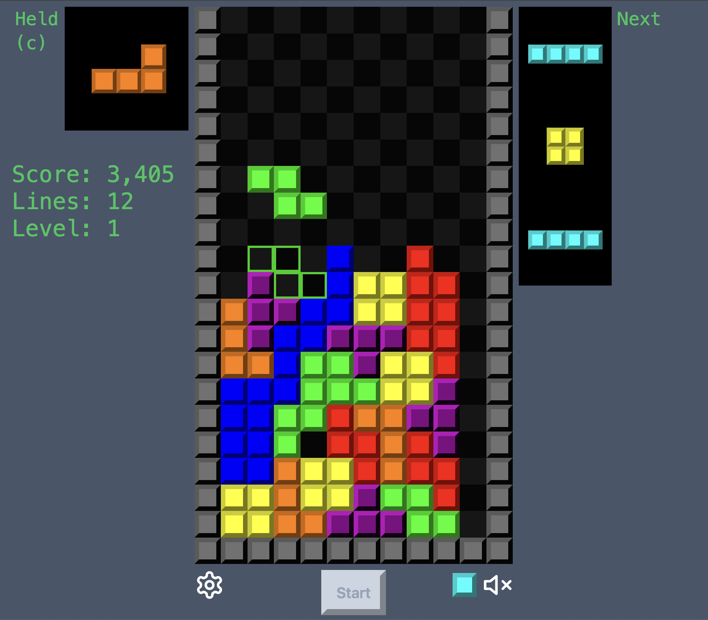
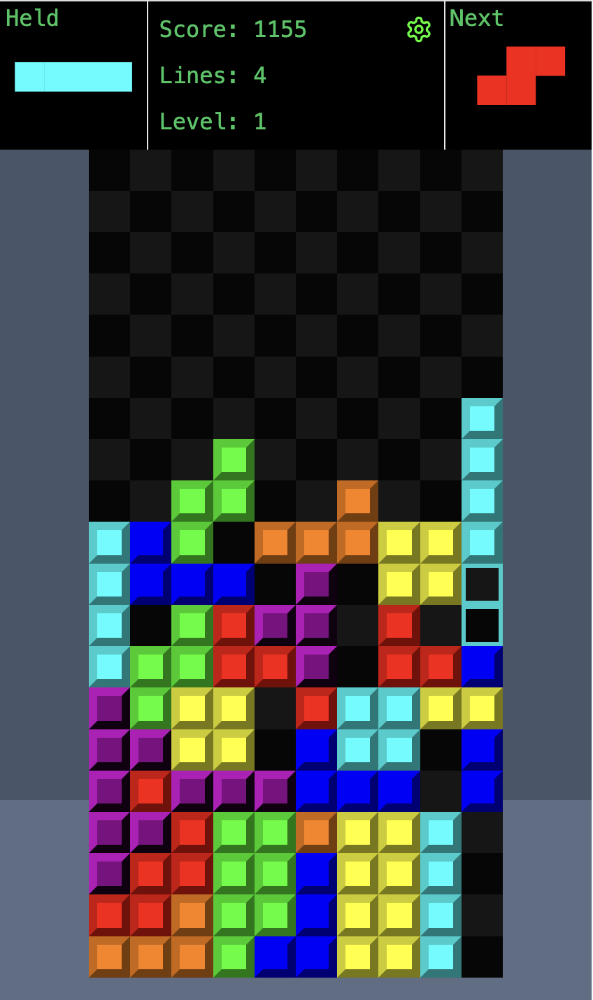

# Tetris

[Live](https://tetris.binarysmile.com)

A Tetris clone. Game logic implemented in TypeScript, rendered/controlled in React, see [MerlinTetris](https://github.com/briansmiley/MerlinTetris) for an example of a p5.js rendering layer.

    

        
        Desktop
    

    

        
        Mobile
    

